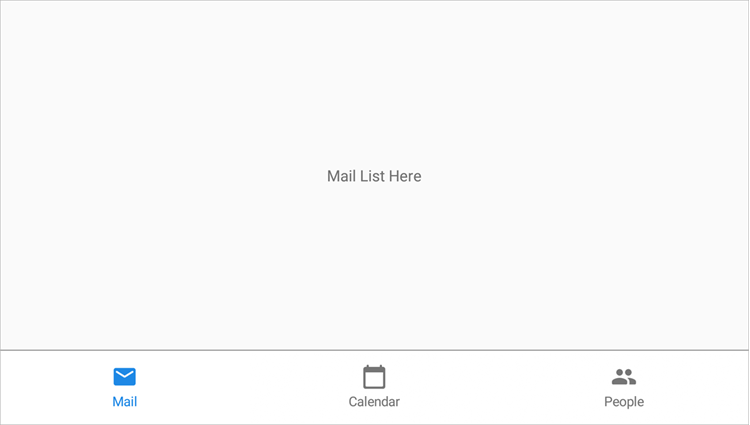

<!-- default file list -->
*Files to look at*:

* [MauiProgram.cs](./TabView_CreateItems/MauiProgram.cs)
* [MainPage.xaml](./TabView_CreateItems/MainPage.xaml)
* [MainPage.xaml.cs](./TabView_CreateItems/MainPage.xaml.cs)
<!-- default file list end -->

# Create MAUI Tab View Items Manually

This lesson explains how to use the [TabView](http://docs.devexpress.com/MAUI/DevExpress.Maui.Navigation.TabView) component with manually created tab items to implement bottom tab navigation in a .NET MAUI application.

1. Install a [.NET MAUI development](https://docs.microsoft.com/en-gb/dotnet/maui/get-started/installation) environment and open the solution in Visual Studio 22 Preview.
2. Register the following NuGet feed in Visual Studio: https://nuget.devexpress.com/free/api.  
	If you are an active DevExpress [Universal](https://www.devexpress.com/subscriptions/universal.xml) customer or have registered our [free Xamarin UI controls](https://www.devexpress.com/xamarin/), this MAUI preview will be available in your personal NuGet feed automatically.
4. Restore NuGet packages.  
5. Run the application on an Android device or emulator.  



The following step-by-step instructions describe how to create the same application.

## Create a New MAUI Application and Add a Tab View

Create a new .NET MAUI solution in Visual Studio 22 Preview.  
Refer to the following Microsoft documentation for more information on how to get started with .NET MAUI: [.NET Multi-platform App UI](https://docs.microsoft.com/en-gb/dotnet/maui/).

Register https://nuget.devexpress.com/free/api as a package source in Visual Studio, if you are not an active DevExpress [Universal](https://www.devexpress.com/subscriptions/universal.xml) customer or have not yet registered our [free Xamarin UI controls](https://www.devexpress.com/xamarin/).

Install the **DevExpress.Maui.Navigation** package from your NuGet feed.

In the *MauiProgram.cs* file, register a handler for the [TabView](http://docs.devexpress.com/MAUI/DevExpress.Maui.Navigation.TabView) class:

```cs
using Microsoft.Maui;
using Microsoft.Maui.Hosting;
using Microsoft.Maui.Controls.Hosting;
using DevExpress.Maui.Navigation;

namespace TabView_CreateItems {
    public static class MauiProgram {
        public static MauiApp CreateMauiApp() {
            var builder = MauiApp.CreateBuilder();
            builder
                .UseMauiApp<App>()
                .ConfigureFonts(fonts =>
                {
                    fonts.AddFont("OpenSans-Regular.ttf", "OpenSansRegular");
                })
                .ConfigureMauiHandlers((handlers => handlers.AddHandler<TabView, TabViewHandler>()));
            return builder.Build();
        }
    }
}
```

In the *MainPage.xaml* file, use the *dxn* prefix to declare the **DevExpress.Maui.Navigation** namespace and add a [TabView](http://docs.devexpress.com/MAUI/DevExpress.Maui.Navigation.TabView) object to the main page:

```xaml
<ContentPage xmlns="http://schemas.microsoft.com/dotnet/2021/maui"
             xmlns:x="http://schemas.microsoft.com/winfx/2009/xaml"
             xmlns:dxn="clr-namespace:DevExpress.Maui.Navigation;assembly=DevExpress.Maui.Navigation"
             x:Class="TabView_CreateItems.MainPage">
     <dxn:TabView/>
</ContentPage>
```

## Create Tab Items
Add icons for tabs ([.svg files](./TabView_CreateItems/Resources/Images/)) to the project and set their **Build Action** property to **MauiImage**.

Add [TabViewItem](http://docs.devexpress.com/MAUI/DevExpress.Maui.Navigation.TabViewItem) objects to the [TabView.Items](http://docs.devexpress.com/MAUI/DevExpress.Maui.Navigation.TabView.Items) collection:

```xaml
<dxn:TabView>
    <dxn:TabViewItem HeaderText="Mail"
                     HeaderIcon="email.svg">
        <dxn:TabViewItem.Content>
            <Grid>
                <Label Text="Mail List Here" 
                       HorizontalOptions="Center" 
                       VerticalOptions="CenterAndExpand"/>
            </Grid>
        </dxn:TabViewItem.Content>
    </dxn:TabViewItem>

    <dxn:TabViewItem HeaderText="Calendar"
                     HeaderIcon="calendar.svg">
        <dxn:TabViewItem.Content>
            <Grid>
                <Label Text="Calendar Here" 
                       HorizontalOptions="Center" 
                       VerticalOptions="CenterAndExpand"/>
            </Grid>
        </dxn:TabViewItem.Content>
    </dxn:TabViewItem>

    <dxn:TabViewItem HeaderText="People"
                     HeaderIcon="people.svg">
        <dxn:TabViewItem.Content>
            <Grid>
                <Label Text="People Here"
                       HorizontalOptions="Center" 
                       VerticalOptions="CenterAndExpand"/>
            </Grid>
        </dxn:TabViewItem.Content>
    </dxn:TabViewItem>
</dxn:TabView>
```

Note that you can skip the **Items** property tags in the XAML markup as this property has a *ContentProperty* attribute.

## Customize the Tab View Appearance

Move the header panel with tabs to the bottom of the page, set up tabs to fill all the available space in the header panel, and hide the selected item indicator:

```xaml
<dxn:TabView HeaderPanelPosition="Bottom"
             ItemHeaderWidth="*"
             IsSelectedItemIndicatorVisible="False">
    <!-- Tab items here. -->
</dxn:TabView>
```

Specify icon and text colors for tabs in the header panel. Use the **ItemHeaderIconColor** and **ItemHeaderTextColor** properties of the [TabView](http://docs.devexpress.com/MAUI/DevExpress.Maui.Navigation.TabView) object to specify the same colors for all tab items when they are not selected, and the **SelectedHeaderIconColor** and **SelectedHeaderTextColor** properties of [TabViewItem](http://docs.devexpress.com/MAUI/DevExpress.Maui.Navigation.TabViewItem) objects to set icon and text colors for individual tabs in the selected state:

```xaml
<ContentPage xmlns="http://schemas.microsoft.com/dotnet/2021/maui"
             xmlns:x="http://schemas.microsoft.com/winfx/2009/xaml"
             x:Class="TabView_CreateItems.MainPage"
             xmlns:dxn="clr-namespace:DevExpress.Maui.Navigation;assembly=DevExpress.Maui.Navigation">
    <ContentPage.Resources>
        <Color x:Key="unselected_grey">#757575</Color>
        <Color x:Key="mail_blue">#1e88e5</Color>
        <Color x:Key="calendar_green">#43a047</Color>
        <Color x:Key="people_red">#e53935</Color>
    </ContentPage.Resources>
    <dxn:TabView HeaderPanelPosition="Bottom"
                 IsSelectedItemIndicatorVisible="False"
                 ItemHeaderWidth="*"
                 ItemHeaderIconColor="{StaticResource unselected_grey}"
                 ItemHeaderTextColor="{StaticResource unselected_grey}">
        <dxn:TabViewItem HeaderText="Mail"
                         HeaderIcon="email.svg"
                         SelectedHeaderIconColor="{StaticResource mail_blue}"
                         SelectedHeaderTextColor="{StaticResource mail_blue}">
            <dxn:TabViewItem.Content>
                <Grid>
                    <Label Text="Mail List Here" 
                           HorizontalOptions="Center" 
                           VerticalOptions="CenterAndExpand"/>
                </Grid>
            </dxn:TabViewItem.Content>
        </dxn:TabViewItem>

        <dxn:TabViewItem HeaderText="Calendar"
                         HeaderIcon="calendar.svg"
                         SelectedHeaderIconColor="{StaticResource calendar_green}"
                         SelectedHeaderTextColor="{StaticResource calendar_green}">
            <dxn:TabViewItem.Content>
                <Grid>
                    <Label Text="Calendar Here" 
                           HorizontalOptions="Center" 
                           VerticalOptions="CenterAndExpand"/>
                </Grid>
            </dxn:TabViewItem.Content>
        </dxn:TabViewItem>

        <dxn:TabViewItem HeaderText="People"
                         HeaderIcon="people.svg"
                         SelectedHeaderIconColor="{StaticResource people_red}"
                         SelectedHeaderTextColor="{StaticResource people_red}">
            <dxn:TabViewItem.Content>
                <Grid>
                    <Label Text="People Here"
                           HorizontalOptions="Center" 
                           VerticalOptions="CenterAndExpand"/>
                </Grid>
            </dxn:TabViewItem.Content>
        </dxn:TabViewItem>
    </dxn:TabView>
</ContentPage>
```
